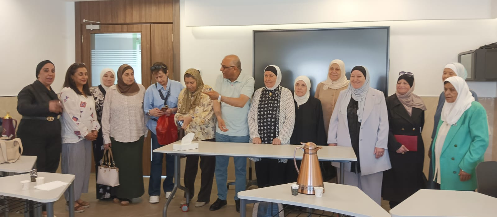
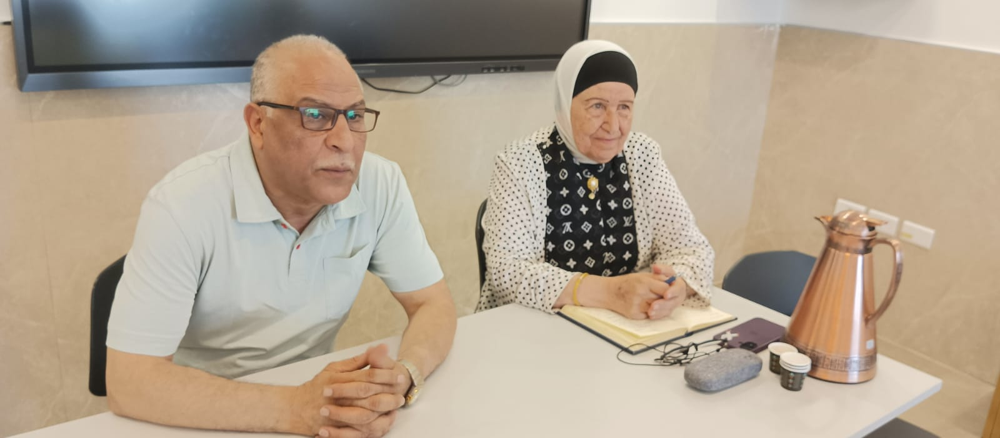
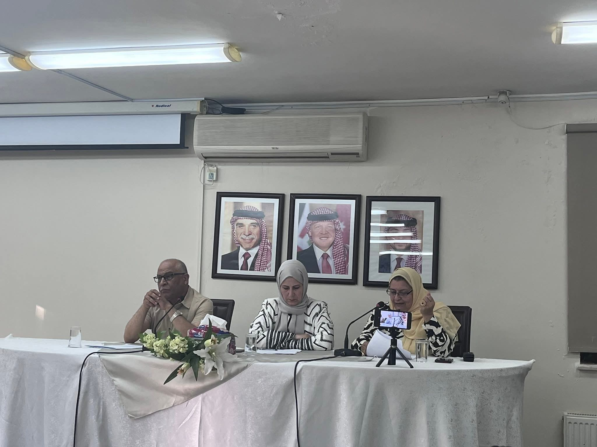
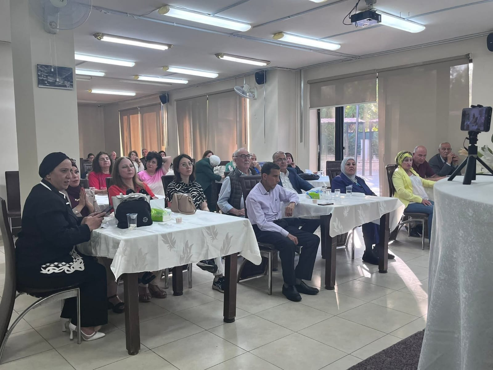
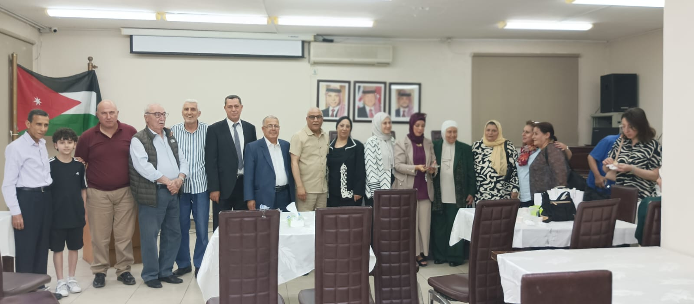
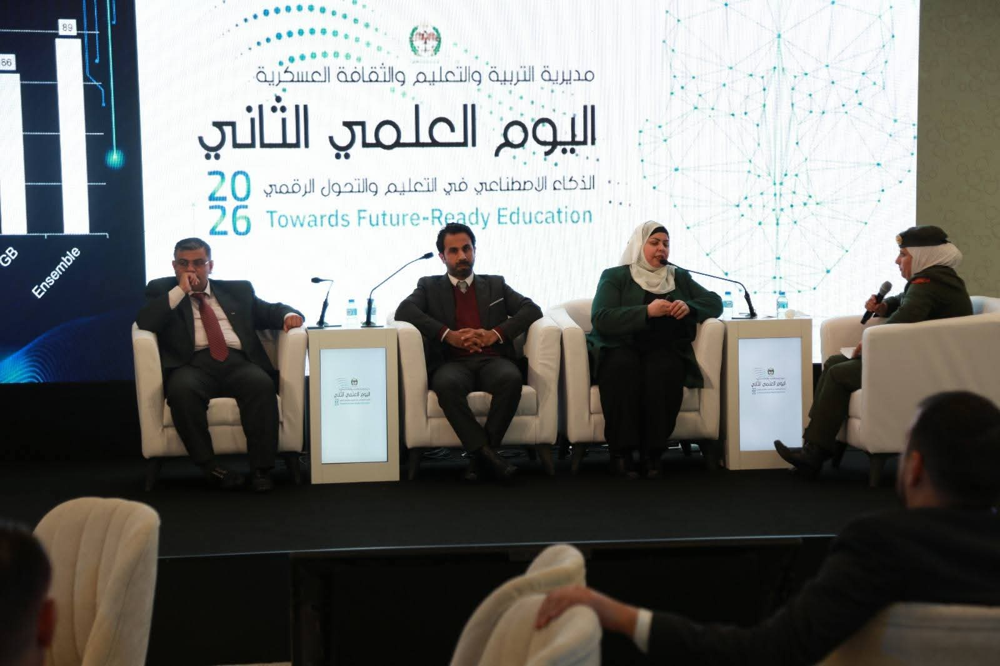
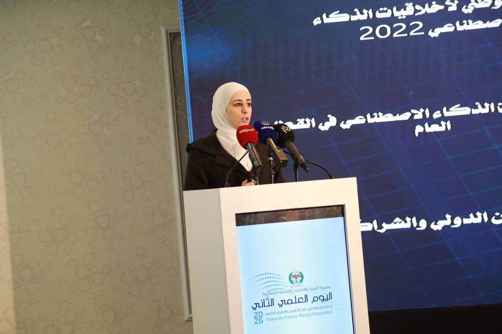
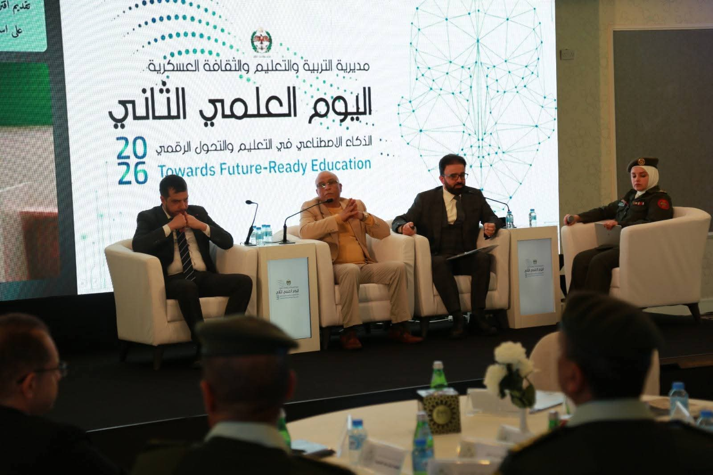

# Mustanef Image Evidence

This file documents selected photographic evidence used in the Mustanef repository. The images are organized by event and should be cited with their event context.

## Book Friends Club — 2026

### Group Photograph

Participants following the Book Friends Club public dialogue on transformative artificial intelligence and its potential effects on work, health, wellbeing, marriage, and social relationships, Jordan, 2026.

### Discussion Photograph

Prof. Dr. Ahmad Al-Nuaimi and a participant during the Book Friends Club dialogue on transformative artificial intelligence, Jordan, 2026.

## Senior Pioneers Forum — 27 June 2026

### Seminar Panel

Panel during the seminar “Artificial Intelligence and Its Relationship to Life” at the Senior Pioneers Forum, Jordan, 27 June 2026.

### Audience

Participants attending the seminar “Artificial Intelligence and Its Relationship to Life” at the Senior Pioneers Forum, Jordan, 27 June 2026.

### Group Photograph

Speakers and participants following the Digital Al-Jazari seminar at the Senior Pioneers Forum, Jordan, 27 June 2026.

## Second Scientific Day — 2026

The Second Scientific Day was organized by the Directorate of Education and Military Culture under the theme of artificial intelligence in education and digital transformation toward future-ready education.

### Panel Session I

A panel discussion during the Second Scientific Day on artificial intelligence in education and digital transformation, Jordan, 2026.

### Address

An address delivered during the Second Scientific Day, with the official event identity and future-ready education theme visible, Jordan, 2026.

### Panel Session II

A panel discussion examining artificial intelligence, education, and digital transformation during the Second Scientific Day, Jordan, 2026.

## Documentation Note

These photographs document public and institutional activities associated with Digital Al-Jazari’s AI-readiness work. Names of individuals should be added only when confirmed. Photographer credits may be appended when available.
